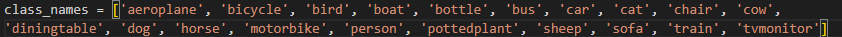
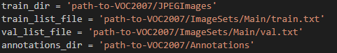
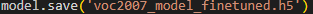
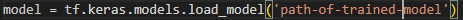
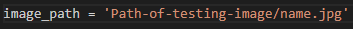
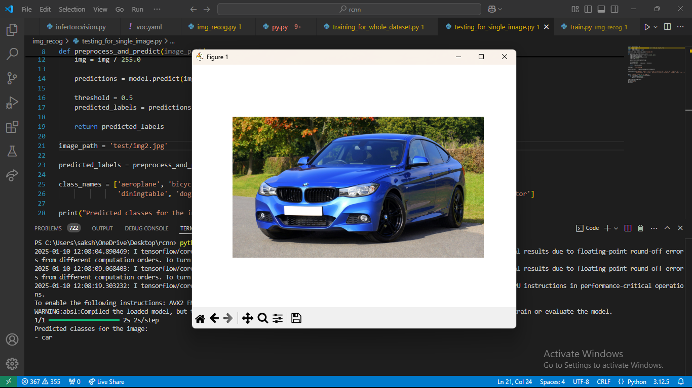

# Image Recognition using MobileNetV2 with VOC2007 Dataset
This project demonstrates the application of deep learning techniques for multi-label image classification using the VOC2007 dataset. The model is based on the MobileNetV2 architecture, which is fine-tuned to classify images into 20 object categories. Each image can contain multiple objects, making this a multi-label classification problem.


## Project Overview

The goal of this project is to develop a deep learning model that can predict multiple object classes in an image from the VOC2007 dataset. The dataset includes 20 different object categories such as aeroplane, bicycle, dog, person, etc. The model uses transfer learning with MobileNetV2 and fine-tunes it on the VOC2007 dataset to achieve accurate predictions.

## Features
- Multi-label image classification.
  
- Utilizes pre-trained MobileNetV2 for feature extraction.
- Data augmentation techniques to enhance model generalization.
- Evaluation using precision, recall, and F1-score.
- Visualizations of loss and accuracy during training.

## Installation

To run this project, you need to have Python 3.6+ installed, along with the following dependencies:

- TensorFlow 2.x
- Numpy
- Scikit-learn
- Matplotlib
- PIL (Pillow)

### Install dependencies

```bash
pip install tensorflow numpy scikit-learn matplotlib Pillow
```

### How to work with this model?

#### Cloning the repository

```bash
git clone https://github.com/saksham1253/Image-Recognition-using-MobileNetV2.git
```
#### Where to find the file?
Wherever the terminal is currently open, a clone of the model will be created in that folder.

#### Training the model
First, you need to train the model using the VOC2007 dataset and define the paths of the following as follows: 


#### Saving the trained model
Before training the model you need to define the name of the trained model file and done this as follows:


#### Testing the model
This model works for a single image and predicts the class in the image according to the dataset.
Do the changes on the testing_for_single_image.py file.

##### Define the name of the file of the trained model
You need to import the trained model and put the name as follows:


##### Image Path For Prediction
For prediction, you need to give the path of the image for which you want to predict the class.


#### Sample Output

For the above image, the model predicts the car class as shown in the image.

 


